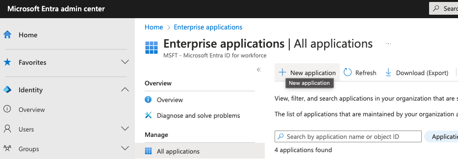
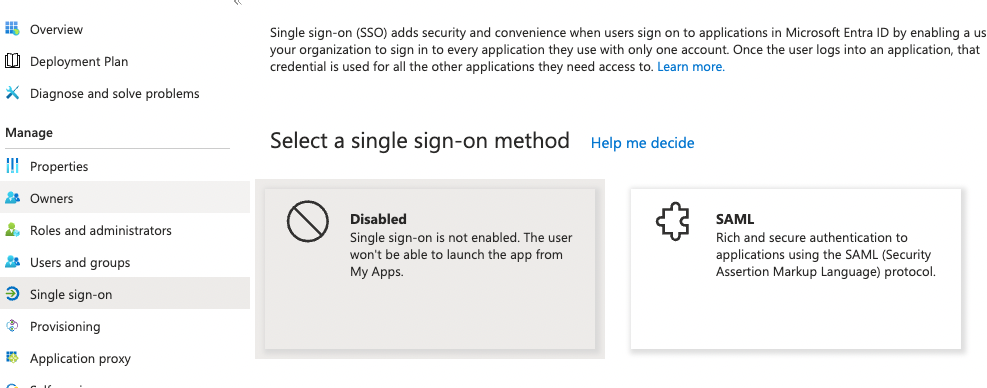
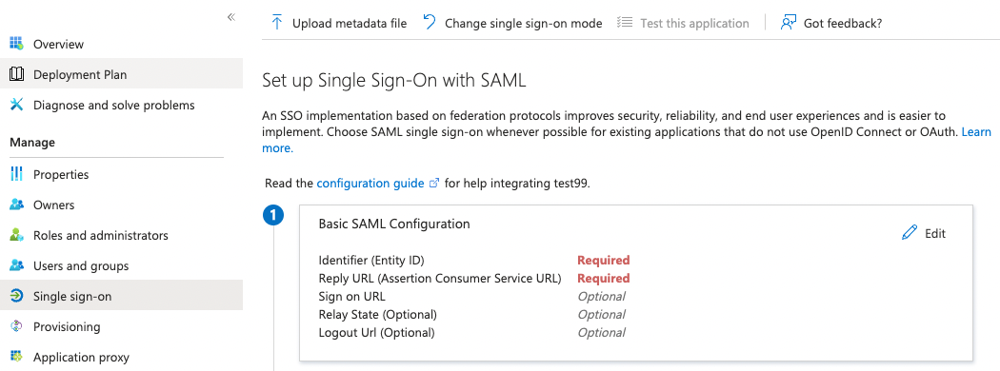
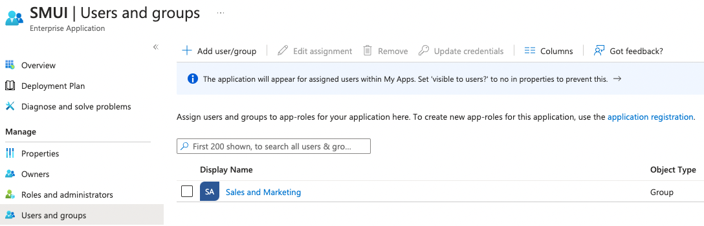

.. _smui-config:

=============
Configuration
=============

SMUI may be configured by passing environment variables to its docker
container. The following section describes all configuration
parameters.

.. note::

    Environment variables are the preferred way to configure your
    production environment. During development (i.e. outside a docker
    environment) it is possible to use a local ``smui-dev.conf`` file
    (see the :ref:`development setup <smui-dev-config>` documentation).

The following sections describe application configs in more detail.

.. _smui-basic-settings:

Basic settings
--------------

The following settings can (and should) be overwritten on
application.conf in your own ``smui-prod.conf`` or in your deployment,
using environment variables:

.. list-table:: SMUI basic settings
   :widths: 20 20 50 30
   :header-rows: 1

   * - Config key
     - Environment variable
     - Description
     - Default
   * - ``db.default.driver``
     - ``SMUI_DB_JDBC_DRIVER``
     - JDBC database driver
     - ``com.mysql.cj.jdbc.Driver``.
   * - ``db.default.url``
     - ``SMUI_DB_URL``
     - Database host and optional connection parameters (JDBC connection string).
     - ``jdbc:mysql://host.docker.internal/smui?autoReconnect=true&useSSL=false``.
   * - ``db.default.username``
     - ``SMUI_DB_USER``
     - Database user
     - ``smui``.
   * - ``db.default.password``
     - ``SMUI_DB_PASSWORD``
     - Database password
     - ``smui``
   * - ``smui2solr.SRC_TMP_FILE``
     - ``SMUI_2SOLR_SRC_TMP_FILE``
     - Path to temp file (i.e. where to output the generated ``rules.txt`` file after generation). **WARNING:** Deprecated as of v3.4, will be replaced soon.
     - ``/tmp/search-management-ui_rules-txt.tmp`` (recommended: leave default).
   * - ``smui2solr.DST_CP_FILE_TO``
     - ``SMUI_2SOLR_DST_CP_FILE_TO``
     - LIVE ``rules.txt`` destination file for the default deployment script. See :ref:`Details on rules.txt deployment<smui-rules-deployment-details>` for more info. WARNING: Deprecated as of v3.4, will be replaced soon.
     - ``/usr/bin/solr/defaultCore/conf/rules.txt``
   * - ``smui.deployment.git.repo-url``
     - ``SMUI_DEPLOYMENT_GIT_REPO_URL``
     - Only necessary for git deployment (see :ref:`git deployment documentation<smui-rules-deployment-git>`).
     - ``ssh://git@localhost/git-server/repos/smui_rulestxt_repo.git``
   * - ``smui2solr.deployment.git.filename.common-rules-txt``
     - ``SMUI_DEPLOYMENT_GIT_FN_COMMON_RULES_TXT``
     - Bare filename of the common ``rules.txt`` file that should be pushed to the git repository.
     - ``rules.txt``
   * - ``smui2solr.SOLR_HOST``
     - ``SMUI_2SOLR_SOLR_HOST``
     - Virtual local Solr instance. **WARNING:** Deprecated as of v3.4, will be replaced soon.
     - ``localhost:8983``
   * - ``play.http.secret.key``
     - ``SMUI_PLAY_APPLICATION_SECRET``
     - Encryption key for server/client communication (Play 2.6 standard). This positively needs to be set to a high-entropy value in production environments.
     - **WARNING:** insecure default.

SMUI with SQLite (in a Docker setup)
~~~~~~~~~~~~~~~~~~~~~~~~~~~~~~~~~~~~

To use SMUI with SQLite in a Docker setup, you need to:

* Make sure the SQLite database is read/write mounted to the SMUI Docker container.
* Use the correct JDBC driver for SQLite with a URL pointing to the mounted database file, e.g.

**NOTE:** Play is not good in handling SQLite out-of-the-box. We need to disable locks for Play database evolutions. A ``custom-application.conf`` is therefore also needed. It contains:

::

   include "application.conf"
   
   play.evolutions.useLocks=false

This is the complete command to run a SMUI container with a SQLite DB and the necessary ``custom-application.conf`` (**NOTE:** environment variables for the CMD must be set in the environment starting SMUI).

::

   docker run -p 9000:9000 \
       --mount type=bind,source=/PATH/TO/local_sqlite_smui.db,target=/smui/smui.db \
       --mount type=bind,source=/PATH/TO/custom-application.conf,target=/smui/conf/custom-application.conf \
       -e SMUI_DB_JDBC_DRIVER=org.sqlite.JDBC \
       -e SMUI_DB_URL=jdbc:sqlite:/smui/smui.db \
       querqy/smui \
       java -Dpidfile.path=$SMUI_CONF_PID_PATH -Dlogback.configurationFile=$SMUI_CONF_LOGBACK_XML_PATH -Dhttp.port=$SMUI_CONF_HTTP_PORT -Dconfig.file="/smui/conf/custom-application.conf" -jar /smui/search-management-ui-assembly-$SMUI_VERSION.jar

Advanced configuration
----------------------

The following sections describe the configuration of:

-  application behaviour / feature toggles
   (e.g. rule tagging)
-  details and options for the deployment (of Querqy’s ``rules.txt``
   file)
-  authentication

The following tables only list the config keys as defined in the SMUI `application.conf`_ file.
See the file for the mappings of config keys to environment variables
(e.g. ``SMUI_DB_JDBC_DRIVER`` environment variable sets ``db.default.driver``).

.. _application.conf: https://github.com/querqy/smui/blob/master/conf/application.conf

.. _smui-config-features:

Feature toggles
~~~~~~~~~~~~~~~

The following settings are optional and define the general SMUI behaviour:

.. list-table:: SMUI advanced application settings
   :widths: 20 50 30
   :header-rows: 1

   * - Config key
     - Description
     - Default
   * - ``toggle.ui-concept.updown-rules.combined``
     - Show UP(+++) fields instead of separated rule and intensity fields.
     - ``true``
   * - ``toggle.ui-concept.all-rules.with-solr-fields``
     - Offer a separated “Solr Field” input to the user (UP/DOWN, FILTER).
     - ``true``
   * - ``toggle.rule-deployment.log-rule-id``
     - With every exported search input, add an additional ``@_log`` line that identifies the ID of the rule (if info logging in the search-engine / Solr for querqy is activated, see ``querqy.infoLogging= on``, it is being communicated in the search-engine’s / Solr response).
     - ``false``
   * - ``toggle.rule-deployment.split-decompound-rule-txt``
     - Separate decompound synonyms (``SOME\* => SOME $1``) into a separated rules.txt file. WARNING: Activating this results in the need of having the second special-purpose-DST_CP_FILE_TO configured (see below). Temp file path for this purpose will be generated by adding a ``-2`` to ``smui2solr.SRC_TMP_FILE``. WARNING: Deprecated as of v3.4, will be replaced soon.
     - ``false``
   * - ``toggle.rule-deployment.split-decompound-rule-txt-DST_CP_FILE_TO``
     - Path to productive querqy ``decompound-rules.txt`` (within Solr context). WARNING: Deprecated as of v3.4, will be replaced soon.
     -  Example content, that needs to be adjusted, if split for decompound rules.txt has been activated.
   * - ``toggle.rule-deployment.pre-live.present``
     - Make separated deployments PRELIVE vs. LIVE possible (and display a button for that on the frontend).
     - ``false``
   * - ``smui2solr.deploy-prelive-fn-rules-txt``
     - PRELIVE ``rules.txt`` destination file for the default deployment script. See “Details on rules.txt deployment” for more info.
     -  ``/usr/bin/solr/defaultCore/conf/rules.txt``
   * - ``smui2solr.deploy-prelive-solr-host``
     - Host and port (e.g. ``localhost:8983``) of Solr PRELIVE instance. If left empty, the default deployment script will not trigger a core reload after deployment.
     - Empty. In case core reload on PRELIVE deployments should be triggered, this needs to be set.
   * - ``smui2solr.deploy-prelive-fn-decompound-txt``
     - Separate decompound synonyms for PRELIVE (see above).
     -  ``/usr/bin/solr/defaultCore/conf/rules-decompound.txt``
   * - ``toggle.rule-deployment.custom-script``
     - If set to ``true`` the below custom script (path) is used for deploying the rules.txt files.
     - ``false``
   * - ``toggle.rule-deployment.custom-script-SMUI2SOLR-SH_PATH``
     - Path to an optional custom script (see above).
     - Example content, that needs to be adjusted, if a custom deployment script is activated.
   * - ``toggle.rule-tagging``
     - Should tagging feature be activated.
     - ``false``
   * - ``toggle.predefined-tags-file``
     - Path to optional file, that provides pre-defined rule tags (see “Configure predefined rule tags”).
     -
   * - ``toggle.activate-spelling``
     - Activate spelling items: Add spelling items to maintain common misspellings using the Querqy replace rewriter. The spelling items are exported in a separate replace_rules.txt that is uploaded to Solr.
     - ``false``
   * - ``toggle.ui-list.limit-items-to``
     - Activate list limitation: Limits the list of visible items to the configured number and shows toggle button (*"show more/less"*). Set value to -1 to deactivate list limitation.
     - ``-1``
   * - ``smui2solr.replace-rules-tmp-file``
     - Path to temp file (when ``replace_rules.txt`` generation happens)
     - ``/tmp/search-management-ui_replace-rules-txt.tmp``
   * - ``smui2solr.replace-rules-dst-cp-file-to``
     - ``/usr/bin/solr/defaultCore/conf/rules.txt``
     - ``/usr/bin/solr/liveCore/conf/replace-rules.txt``
   * - ``smui2solr.deploy-prelive-fn-replace-txt``
     - PRELIVE ``replace_rules.txt`` destination file for the default deployment script. See :ref:`Details on rules.txt deployment<smui-rules-deployment-details>` for more info.
     -  ``/usr/bin/solr/preliveCore/conf/replace-rules.txt``
   * - ``toggle.display-username.default``
     - **WARNING:** Deprecated as of v3.14, will be replaced soon (see `github.com comment on PR#83 <https://github.com/querqy/smui/pull/83#issuecomment-1023284550>`_). Default username for being displayed on the frontend, if no username is available (e.g. for event history).
     - ``Anonymous Search Manager``
   * - ``toggle.activate-eventhistory``
     - Persist an event history for all updates to the search management configuration, and provide an activity log for the search manager. WARNING: If this setting is changed over time (especially from ``true`` to ``false``) events in the history might get lost!
     - ``false``
   * - ``toggle.ui-concept.custom.up-down-dropdown-mappings``
     - Provide custom mapping / step sizes for UP/DOWN boosting/penalising values as JSON (used, if ``toggle.ui-concept.updown-rules.combined`` is set to ``true``). See below for details.
     - ``null`` (No custom mappings)
   * - ``smui.target-environment.config``
     - Target environment configuration (e.g. for preview links). See below for details.
     - Empty target environment. **NOTE:** There will come a dummy config showcasing this feature withz upcoming (majo) releases.

.. note::

	The above described feature toggles are passed to SMUI’s docker container using according environment variables. The mappings can be found in the ``application.conf``.

Predefined rule tags (optional)
~~~~~~~~~~~~~~~~~~~~~~~~~~~~~~~

You can define pre-defined rule tags, that can be used by the
search manager to organise or even adjust the rules exported to the
rules.txt. See
`TestPredefinedTags.json`_ for
structure.

.. _TestPredefinedTags.json: https://github.com/querqy/smui/blob/master/test/resources/TestPredefinedTags.json

.. note::

	The rule tagging feature is disabled by default. You may activate it by setting the configuration key ``toggle.rule-tagging`` to ``true``. See the :ref:`feature configuration<smui-config-features>` section for more information.

Custom UP/DOWN dropdown mappings (optional)
~~~~~~~~~~~~~~~~~~~~~~~~~~~~~~~~~~~~~~~~~~~

SMUI makes life easier when dealing with UP/DOWN boosting/penalising intensities.
It translates raw values passed to querqy to a more comprehensible format to
the search manager working with ``+++`` and ``---`` on the frontend.
By default, a typical intensity range from ``500`` to ``5`` is covered, which
should work with most search engine's (e.g. Solr) schema configurations and the according querqy setup.

However, if SMUI's default does not match the specific needs, the default can be adjusted.
This can be achieved by passing a JSON object describing the desired custom UP/DOWN dropdown
mappings to SMUI while using the ``toggle.ui-concept.custom.up-down-dropdown-mappings`` configuration.
The JSON is passed as an escaped string, which is then validated by SMUI.

Note: If for any reason your custom mappings do not apply, check SMUI's (error) logs,
as it is likely, that the validation yielded an error.

Example configuration setting:

::

   toggle.ui-concept.custom.up-down-dropdown-mappings="[{\"displayName\":\"UP(+++++)\",\"upDownType\":0,\"boostMalusValue\":750},{\"displayName\":\"UP(++++)\",\"upDownType\":0,\"boostMalusValue\":100},{\"displayName\":\"UP(+++)\",\"upDownType\":0,\"boostMalusValue\":50},{\"displayName\":\"UP(++)\",\"upDownType\":0,\"boostMalusValue\":10},{\"displayName\":\"UP(+)\",\"upDownType\":0,\"boostMalusValue\": 5},{\"displayName\":\"DOWN(-)\",\"upDownType\":1,\"boostMalusValue\": 5},{\"displayName\":\"DOWN(--)\",\"upDownType\":1,\"boostMalusValue\": 10},{\"displayName\":\"DOWN(---)\",\"upDownType\":1,\"boostMalusValue\": 50},{\"displayName\":\"DOWN(----)\",\"upDownType\":1,\"boostMalusValue\": 100},{\"displayName\":\"DOWN(-----)\",\"upDownType\":1,\"boostMalusValue\": 750}]"

Note that all attribute/value quotation marks in the JSON string need to be escaped.
The equivalent docker startup argument would be (command line):

::

   docker run \
   ...
     -e SMUI_CUSTOM_UPDOWN_MAPPINGS="[{\"displayName\":\"UP(+++++)\",\"upDownType\":0,\"boostMalusValue\":750},{\"displayName\":\"UP(++++)\",\"upDownType\":0,\"boostMalusValue\":100},{\"displayName\":\"UP(+++)\",\"upDownType\":0,\"boostMalusValue\":50},{\"displayName\":\"UP(++)\",\"upDownType\":0,\"boostMalusValue\":10},{\"displayName\":\"UP(+)\",\"upDownType\":0,\"boostMalusValue\": 5},{\"displayName\":\"DOWN(-)\",\"upDownType\":1,\"boostMalusValue\": 5},{\"displayName\":\"DOWN(--)\",\"upDownType\":1,\"boostMalusValue\": 10},{\"displayName\":\"DOWN(---)\",\"upDownType\":1,\"boostMalusValue\": 50},{\"displayName\":\"DOWN(----)\",\"upDownType\":1,\"boostMalusValue\": 100},{\"displayName\":\"DOWN(-----)\",\"upDownType\":1,\"boostMalusValue\": 750}]"
   ...

Preview search queries (optional)
~~~~~~~~~~~~~~~~~~~~~~~~~~~~~~~~~

Preview links can be configured using the ``smui.target-environment.config`` in your custom ``application.conf``.
Here is an example of a multi tenant, multi language preview configuration.
**NOTE:** The JSON structure is encoded into the HOCON syntax (used by Play / typesafe) as a multiline string:

::

  smui.target-environment.config="""{
    "LIVE": {
      "de": [
        {
          "rulesCollection": "MainTenantDE",
          "tenantTag": null,
          "previewUrlTemplate": "https://www.example.com/de/main-tenant/search?query=$QUERY"
        }, {
          "rulesCollection": "AlternativeTenantDE",
          "tenantTag": "tenant:ALTERNATIVE",
          "previewUrlTemplate": "https://www.example.com/de/alternative-tenant/search?query=$QUERY"
        }
      ],
      "fr": [
        {
          "rulesCollection": "MainTenantFR",
          "tenantTag": null,
          "previewUrlTemplate": "https://www.example.com/fr/main-tenant/search?query=$QUERY"
        }, {
          "rulesCollection": "AlternativeTenantFR",
          "tenantTag": "tenant:ALTERNATIVE",
          "previewUrlTemplate": "https://www.example.com/fr/alternative-tenant/search?query=$QUERY"
        }
      ]
    },
    "PRELIVE": {
      ...
    }
  }"""

The first level of the JSON describes the deployment instance that the preview links points to.
Next is a free-definable organizational identifier - typically encoding the language. Then follows the preview link configuration itself.
Preview links are tight to a rules collection, and might be scoped to specific tenants.
The links are rendered using the magic ``$QUERY`` symbol in the URL template.

**NOTE:** TODO As of v3.15 this will be the designated structure for the deployment description in the future.

Authentication
--------------

In version 4 SMUI has dropped support for its proprietary authentication implementation and adopted the
`pac4j <https://www.pac4j.org/>`_ library. pac4j offers a wide range of authentication and authorization mechanisms.
At the moment, only SAML authentication is provided (tested against MS Azure AD / Entra, other SAML identity
providers should work) but additional authentication mechanisms can be added quickly. Please
`create a Github issue <https://github.com/querqy/smui/issues/new/choose>`_, a
`pull request <https://github.com/querqy/smui/compare>`_, or
`drop us an email <hello@productful.io>`_.

SAML Authentication
~~~~~~~~~~~~~~~~~~~~

Enabling SAML authentication requires a few steps of preparation. We describe the steps below using Microsoft Entra
(ex Azure Active Directory) as the Identity Provider (IdP).

First, create a new SMUI application in your IdP. In MS Entra this can be achieved in the `Application` /
`Enterprise Applications` / `New application` dialogue. You will create a new "non-gallery" application.

Second, enable SAML Single sign-on for SMUI. In MS Entra this is done by Selecting the SAML option in the
`Manage` / `Single sign-on` menu of your newly created application.

Third, assign an entity ID to your new application. This identifier is also called the `Audience Restriction`
or `Audience URI` in other identity providers. In MS Entra this is configured in the `Single sign-on` section of your
newly created application. There, the `Basic SAML Configuration` sub-section's `Identifier (Entity ID)` entry should
contain the ID. There is `some recommendation <https://spaces.at.internet2.edu/display/federation/saml-metadata-entityid>`_
to use a URI for SAML entity IDs but in general any globally unique identifier will work.

Fourth, configure your IdP to return your browser back to a SMUI callback endpoint after successful authentication.
In MS Entra, this happens in the same section as above with the `Reply URL (Assertion Customer Service)` setting.
Here you will need to use your SMUI host's URL appended with `/callback?client_name=SAML2Client`. Please note, that
SAML requires this to be a HTTPS URL. Example: `https://smui.intranet.mycompany.com/callback?client_name=SAML2Client`

Fifth, prepare the identity provider's metadata XML. This includes required signatures and SSO URL configurations
and follows a standard format. In MS Entra you can download the `Federation Metadata XML` in the
`SAML Certificates Section` of the application's Single sign-on configuration dialog. For pac4j only the
`Signature` and `IDPSSODescriptor` elements in the XML are used and you would need to remove (!) additional XML
`RoleDescriptor` elements as we had issues with pac4j complaining about unexpected elements.

Sixth, assign users and/or groups to that new application to enable your users to allow authenticating your SMUI users
against this new application.

After the above steps you are able to run SMUI with enabled SAML authentication with the following environment variables:

::

    # This triggers SMUI to use the SAML2Client
    SMUI_AUTH_CLIENT=SAML2Client

    # This sets the SMUI base URL, required for callbacks etc.
    # Should just be the protocol+hostname+port you run SMUI on
    SMUI_AUTH_BASEURL=https://<add-you-host-here>

    # The SAML entity ID configured in step three above
    SMUI_SAML_SERVICE_PROVIDER_ENTITY_ID=<unique-configured-id>

    # Path to the identity provider metadata XML obtained in step five above
    SMUI_SAML_IDENTITY_PROVIDER_METADATA_PATH=/path/to/idp.xml

    # Path to a keystore for a public/private key pair that SMUI uses to sign SAML messages.
    # If it does not exist it is created during SMUI startup
    SMUI_SAML_KEYSTORE=/tmp/smui_saml_keystore.jks

    # The password to the keystore above. It needs to match the actual keystore password
    # if an existing keystore is provided, otherwise it will be the password SMUI uses
    # when creating the new keystore file.
    SMUI_SAML_KEYSTORE_PASSWORD=keystore-password

    # The password to the private key within the keystore. It needs to match the actual
    # private key password if an existing keystore is provided, otherwise it will be the
    # password SMUI uses when creating the new keystore file.
    SMUI_SAML_PRIVATE_KEY_PASSWORD=private-key-password

    # SMUI will generate an XML file for its own metadata and post that during the SAML
    # authentication process. This is the path where this file will be stored. Please note,
    # that you might need to manually delete this file if you change any of the above configuration.
    SMUI_SAML_SERVICE_PROVIDER_METADATA_PATH=/tmp/smui_sp_metadata.xml

    # SMUI will store authenticated user info in a browser cookie. You can set the maximum
    # duration of this session before requiring re-authentication using this value.
    SMUI_SESSION_MAXAGE=1 day

(!) NOTE: The ``<unique-configured-id>`` (for config ``SMUI_SAML_SERVICE_PROVIDER_ENTITY_ID``) usually starts with ``spn:`` (i.e. for Microsoft Azure/IdP).

Session and Logout
~~~~~~~~~~~~~~~~~~~~

An authenticated user will stay logged in as long as their cookie is valid (see ``SMUI_SESSION_MAXAGE`` value above).
As we currently only support external authentication there is currently no active logout implemented (any logout
would immediately redirect to the identity provider and, if the session with the identity provider still exists,
re-login the user).

Options for rules deployment
----------------------------

Deploying rules.txt via cp/scp
~~~~~~~~~~~~~~~~~~~~~~~~~~~~~~

The default deployment script supports using ``cp`` or ``scp`` file transfer
as methods to deploy the ``rules.txt`` and ``replace_rules.txt`` and triggers a Solr core on the
target system, if configured accordingly. Its behaviour is controlled
using the config variables above, e.g.:

::

   docker run \
     ...
     -e SMUI_2SOLR_DST_CP_FILE_TO=remote_user:remote_pass@remote_host:/path/to/live/solr/defaultCore/conf/rules.txt \
     -e SMUI_2SOLR_SOLR_HOST=remote_solr_host:8983 \
     -e SMUI_DEPLOY_PRELIVE_FN_RULES_TXT=/mnt/prelive_solr_depl/rules.txt \
     -e SMUI_DEPLOY_PRELIVE_SOLR_HOST=docker_host:8983 \
     ...
     -v /path/to/prelive/solr/defaultCore/conf:/mnt/prelive_solr_depl
     ...
     querqy/smui

In this particular example, the LIVE instance of Solr runs on
``remote_solr_host`` and can be reached by ``remote_user`` on
``remote_host`` for ``rules.txt`` deployment (NOTE: ``remote_host`` as
well as ``remote_solr_host`` might even be the same instance, but just
have differing network names). ``scp`` will be chosen by the default
deployment script. In contrast to that, the PRELIVE instance of Solr
resides on the ``docker_host``. File deployment is ensured using an
according docker volume mount. ``cp`` will be chosen.

.. note::

    The example above also accounts for
    ``SMUI_TOGGLE_DEPL_DECOMPOUND_DST`` and
    ``SMUI_DEPLOY_PRELIVE_FN_DECOMPOUND_TXT``, when
    ``SMUI_TOGGLE_DEPL_SPLIT_DECOMPOUND`` is set to ``true``.

.. note::

    The example above also accounts for
    ``SMUI_2SOLR_REPLACE_RULES_DST_CP_FILE_TO`` and
    ``SMUI_DEPLOY_PRELIVE_FN_REPLACE_TXT``, when
    ``SMUI_TOGGLE_SPELLING`` is set to ``true``.

.. _smui-rules-deployment-git:

Deploying rules.txt to a git target
~~~~~~~~~~~~~~~~~~~~~~~~~~~~~~~~~~~

The SMUI docker container comes with an alternative
deployment script for deployment to git, which is located under
``conf/smui2git.sh``.

.. note::

    Your ``rules.txt`` repository needs to be initialised with (at least) the empty files,
    you would like to get managed by SMUI on the ``master`` branch (or branch you would like SMUI to deploy to).

The ``conf/smui2git.sh`` main deployment script uses the
alternative git deployment script, in case a ``GIT`` deployment target
is supplied (for the specific target system). You can use the following
setting to force git deployment for the ``LIVE`` stage, e.g. (command
line):

In the docker container the git deployment will be done in the
``/tmp/smui-git-repo`` path. You need to make sure, that identification is provided to the SMUI docker
environment:

The following example illustrates how to configure SMUI and pass host's identity:

::

   docker run \
     ...
     -v ~/.ssh/id_rsa:/smui/.ssh/id_rsa \
     -v ~/.gitconfig:/home/smui/.gitconfig \
     ...
     -e SMUI_2SOLR_DST_CP_FILE_TO="GIT" \
     -e SMUI_DEPLOYMENT_GIT_REPO_URL="ssh://git@repo-host.tld/smui_rulestxt_repo.git" \
     ...
     querqy/smui

.. note::

    * When working with remote git locations, it might be necessary to also add your git repo host to SMUI's ``/home/smui/.ssh/known_hosts``.
    * As of v3.11.5 only deployment of the common rules.txt file is supported (neither decompound- nor replace-rules.txt files). Support for that might be added in future releases.
    * Currently only git deployment to the LIVE instance is possible.

Creating initial data
---------------------

After the first startup of SMUI, initial data can be inserted. SMUI supports a REST interface to PUT admin entities (like the
following) into the database. This initial data configures Solr collections.

Solr Collections to maintain Search Management rules for
~~~~~~~~~~~~~~~~~~~~~~~~~~~~~~~~~~~~~~~~~~~~~~~~~~~~~~~~

There must exist a minimum of one Solr collection (or
querqy/\ ``rules.txt`` deployment target), that Search Management rules
are maintained for. This must be created before the application can be
used. Example ``curl`` (relative to ``localhost:9000``):

::

   curl -X PUT -H "Content-Type: application/json" -d '{"name":"core_name1", "description":"Solr Search Index/Core #1"}' http://localhost:9000/api/v1/solr-index
   [...]

NOTE: ``solr-index/name`` (in this case ``core_name1``) will be used as
the name of the Solr core, when performing a Core Reload (see
``smui2solr.sh``).

Initial Solr fields
~~~~~~~~~~~~~~~~~~~

Optional. Example ``curl`` (relative to ``localhost:9000``):

::

   curl -X PUT -H "Content-Type: application/json" -d '{"name":"solr-field-1"}' http://localhost:9000/api/v1/{SOLR_INDEX_ID}/suggested-solr-field
   [...]

Where ``solr-field-1`` refers to the field in your configured Solr
schema you would like to make addressable to the Search Manager.
``{SOLR_INDEX_ID}`` refers to the index ID created by the ``solr-index``
call above.

Refresh Browser window and you should be ready to go.
