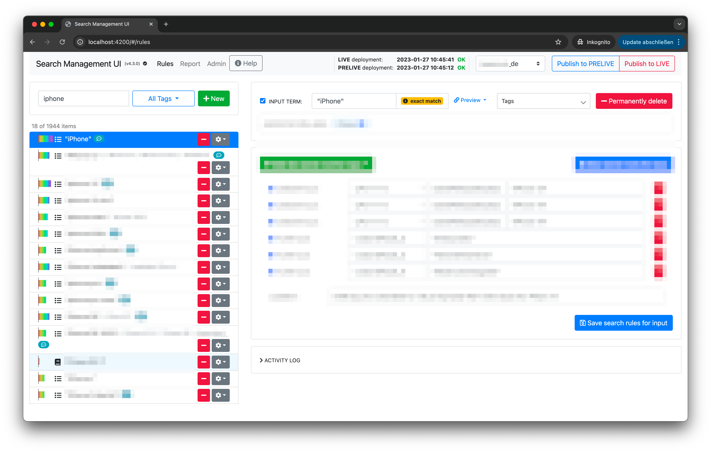
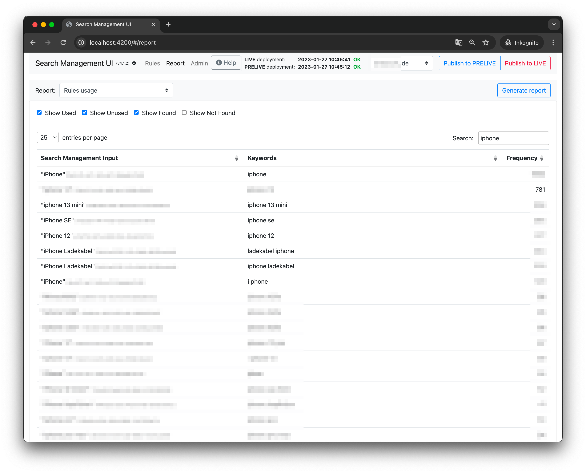

.. _smui_feature_highlights:

=======================
SMUI Feature Highlights
=======================

🌟 Rules Usage Report
---------------------

* Search managers can use the Rules Usage Report to understand, which rules, for which keyword, how frequent have been triggered in the on-site search.
* This enables targeted search management and supports search managers in their daily house-keeping tasks.
* SMUI supports analytics data from arbitrary sources including Google Cloud Storage (GCS).

.. note::

    For enabling and integrating Rules Usage Reports into your search management process, please contact 👉 `hello+smui@productful.io <mailto:hello+smui@productful.io>`_

